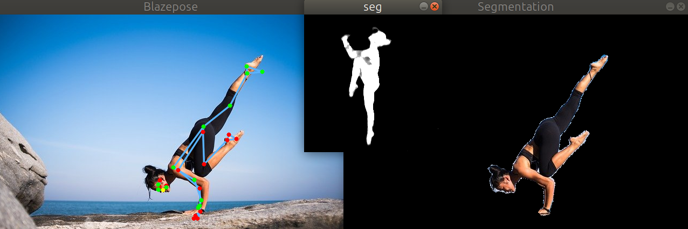

# Blazepose tracking with OpenVINO

Running Google Mediapipe body pose tracking models on OpenVINO.

The solution utilizes a two-step detector-tracker pipeline. A detector first locates the person/pose region-of-interest (ROI) within the frame. The tracker then predicts the pose landmarks within the ROI using the ROI-cropped frame as input. Note that the detector is invoked only as needed, i.e., for the very first frame and when the tracker could no longer identify body pose presence in the previous frame. For other frames the pipeline simply derives the ROI from the previous frame’s pose landmarks.

For DepthAI version, please visit : [depthai_blazepose](https://github.com/geaxgx/depthai_blazepose)


## Install

You need OpenVINO, OpenCV, open3d (for 3d visualization). installed on your computer and to clone/download this repository.

Note that the models were generated using OpenVINO 2021.2.

## Run

**Usage:**

```
> python BlazeposeOpenvino.py  -h

usage: BlazeposeOpenvino.py [-h] [-i INPUT] [-g] [--pd_m PD_M]
                            [--pd_device PD_DEVICE] [--lm_m LM_M]
                            [--lm_device LM_DEVICE]
                            [--min_tracking_conf MIN_TRACKING_CONF] [-c] [-u]
                            [--no_smoothing]
                            [--filter_window_size FILTER_WINDOW_SIZE]
                            [--filter_velocity_scale FILTER_VELOCITY_SCALE]
                            [-3] [-o OUTPUT] [--multi_detection]
                            [--force_detection]

optional arguments:
  -h, --help            show this help message and exit
  -i INPUT, --input INPUT
                        Path to video or image file to use as input
                        (default=0)
  -g, --gesture         enable gesture recognition
  --pd_m PD_M           Path to an .xml file for pose detection model
  --pd_device PD_DEVICE
                        Target device for the pose detection model
                        (default=CPU)
  --lm_m LM_M           Path to an .xml file for landmark model
  --lm_device LM_DEVICE
                        Target device for the landmark regression model
                        (default=CPU)
  --min_tracking_conf MIN_TRACKING_CONF
                        Minimum confidence value ([0.0, 1.0]) from the
                        landmark-tracking model for the pose landmarks to be
                        considered tracked successfully, or otherwise person
                        detection will be invoked automatically on the next
                        input image. (default=0.7)
  -c, --crop            Center crop frames to a square shape before feeding
                        pose detection model
  -u, --upper_body      Use an upper body model
  --no_smoothing        Disable smoothing filter
  --filter_window_size FILTER_WINDOW_SIZE
                        Smoothing filter window size. Higher value adds to lag
                        and to stability (default=5)
  --filter_velocity_scale FILTER_VELOCITY_SCALE
                        Smoothing filter velocity scale. Lower value adds to
                        lag and to stability (default=10)
  -3, --show_3d         Display skeleton in 3d in a separate window (valid
                        only for full body landmark model)
  -o OUTPUT, --output OUTPUT
                        Path to output video file
  --multi_detection     Force multiple person detection (at your own risk, the
                        original Mediapipe implementation is designed for one
                        person tracking only)
  --force_detection     Force person detection on every frame (never use
                        landmarks from previous frame to determine ROI)

```
**Examples :**

- To use default webcam camera as input :

    ```python3 BlazeposeOpenvino.py```

- To use a file (video or image) as input :

    ```python3 BlazeposeOpenvino.py -i filename```

- To show the skeleton in 3D (note that it will lower the FPS):

    ```python3 BlazeposeOpenvino.py -3```

- To demo gesture recognition :

    ```python3 BlazeposeOpenvino.py -g```

    This is a very basic demo that can read semaphore alphabet by measuring arm angles.


- By default, the inferences are run on the CPU. For each model, you can choose the device where to run the model. For instance, if you want to run both models on a NCS2 :

    ```python3 BlazeposeOpenvino.py --pd_device MYRIAD --lm_device MYRIAD```

- By default, a temporal filter smoothes the landmark positions. You can tune the smoothing with the arguments *--filter_window_size* and *--filter_velocity_scale*. Use *--no_smoothing* to disable the filter.

Use keypress between 1 and 6 to enable/disable the display of body features (bounding box, landmarks, scores, gesture,...), 'f' to show/hide FPS, 's' to show the segmentation output (see explanation below), spacebar to pause, Esc to exit.

**Segmentation :**

*Note this is a totally experimental feature since I couldn't find any related documentation.*

In addition to the landmarks and a score, the tracker neural net outputs a 1x128x128 array called 'output_segmentation'. After applying the sigmoid function to this array, you can use the result as a mask on the original picture. This is what you get (can be displayed with keystroke 's'):




## The models 
You can directly find the model files (.xml and .bin) under the 'models' directory. Below I describe how to get the files in case you need to regenerate the models.

1) Clone this github repository in a local directory (DEST_DIR)
2) In DEST_DIR/models directory, download the source tflite models from Mediapipe:
* [Pose detection model](https://github.com/google/mediapipe/blob/master/mediapipe/modules/pose_detection/pose_detection.tflite)
* [Full-body pose landmark model](https://github.com/google/mediapipe/tree/master/mediapipe/modules/pose_landmark/pose_landmark_full_body.tflite)
* [Upper-body pose landmark model](https://github.com/google/mediapipe/tree/master/mediapipe/modules/pose_landmark/pose_landmark_upper_body.tflite)
3) Install the amazing [PINTO's tflite2tensorflow tool](https://github.com/PINTO0309/tflite2tensorflow). Use the docker installation which includes many packages including a recent version of Openvino.
3) From DEST_DIR, run the tflite2tensorflow container:  ```./docker_tflite2tensorflow.sh```
4) From the running container: 
```
cd resources/models
./convert_models.sh
```
The *convert_models.sh* converts the tflite models in tensorflow (.pb), then converts the pb file into Openvino IR format (.xml and .bin). By default, the precision used is FP32. To generate in FP16 precision, run ```./convert_models.sh FP16```


**Explanation about the Model Optimizer params :**
The frames read by OpenCV are BGR [0, 255] frames . The original tflite pose detection model is expecting RGB [-1, 1] frames. ```--reverse_input_channels``` converts BGR to RGB. ```--mean_values [127.5,127.5,127.5] --scale_values [127.5,127.5,127.5]``` normalizes the frames between [-1, 1]. The original hand landmark model is expecting RGB [0, 1] frames. Therefore, the following arguments are used ```--reverse_input_channels --scale_values [255.0, 255.0, 255.0]```


## Credits
* [Google Mediapipe](https://github.com/google/mediapipe)
* Katsuya Hyodo a.k.a [Pinto](https://github.com/PINTO0309), the Wizard of Model Conversion !
* [Tai Chi Step by Step For Beginners Training Session 4](https://www.youtube.com/watch?v=oawZ_7wNWrU&ab_channel=MasterSongKungFu)
* [Semaphore with The RCR Museum](https://www.youtube.com/watch?v=DezaTjQYPh0&ab_channel=TheRoyalCanadianRegimentMuseum)